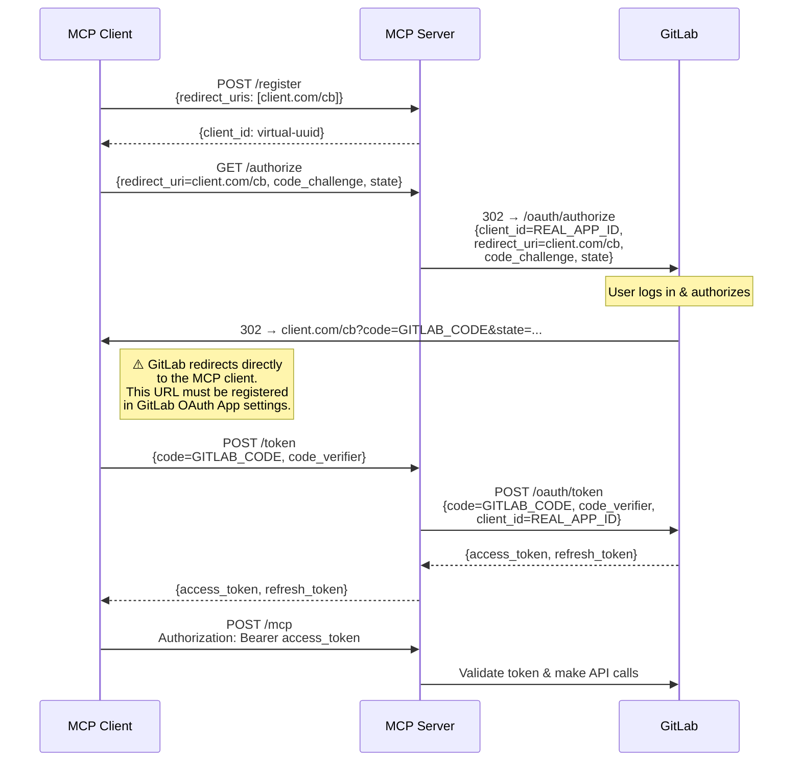
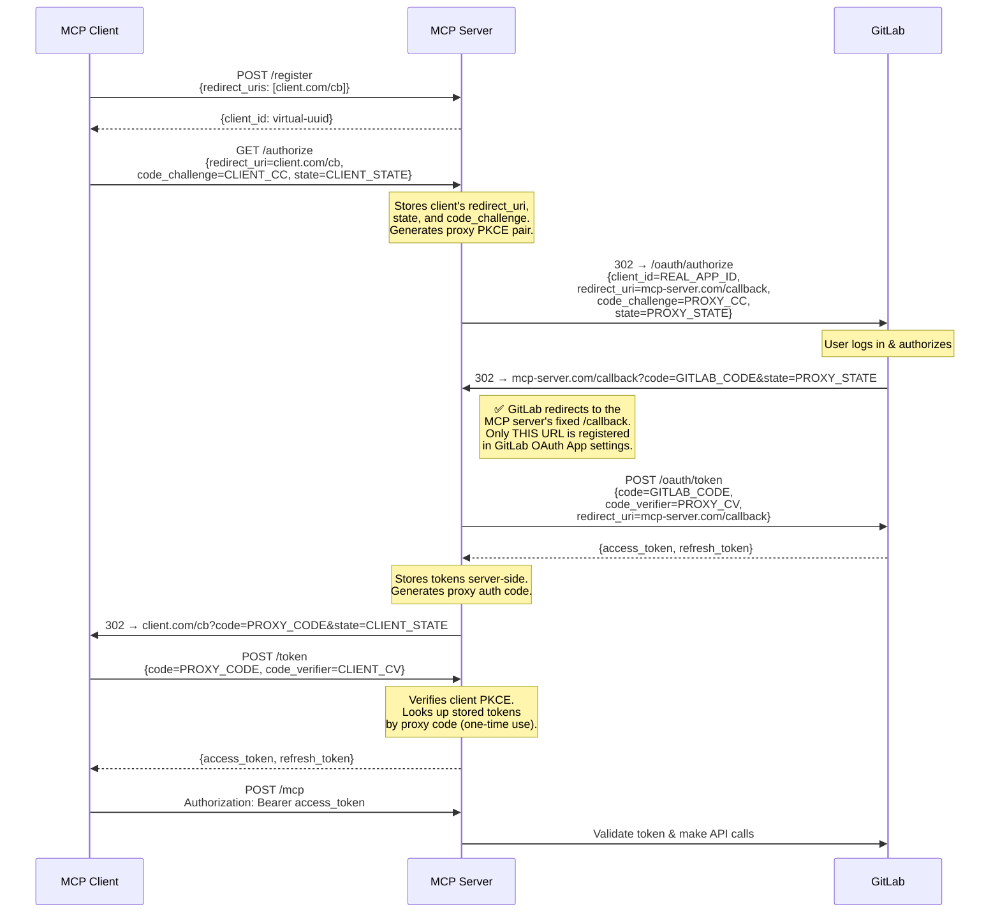

# GitLab MCP OAuth Callback Proxy

## Problem

The current OAuth flow requires each MCP client's callback URL to be pre-registered in the GitLab OAuth Application settings. This means GitLab admin involvement for every new client deployment.

## When You Need This

Enable callback proxy mode when all of the following are true:

- You run a public or remote MCP server with `GITLAB_MCP_OAUTH=true`.
- Your MCP client sends its own callback URL, such as `redirect_uri=http://127.0.0.1:...` or another client-owned callback.
- GitLab returns `invalid_request` or `Unregistered redirect_uri`.
- You want the GitLab OAuth Application to know only the MCP server callback URL, not every MCP client callback URL.

In this mode, GitLab should only register `https://mcp-server.example.com/callback`
or the equivalent `{MCP_SERVER_URL}/callback` for your deployment.

## Common Misconfiguration

Do not try to fix remote MCP OAuth by setting
`GITLAB_OAUTH_REDIRECT_URI=https://mcp-server.example.com/callback`. That variable
is for local OAuth (`GITLAB_USE_OAUTH`) only.

`GITLAB_OAUTH_REDIRECT_URI` is read by the local OAuth client initialization path.
The remote MCP OAuth provider builds its GitLab callback from `MCP_SERVER_URL`
only when `GITLAB_OAUTH_CALLBACK_PROXY=true`.

In the default passthrough mode, the client-provided `redirect_uri` can still be
forwarded to GitLab. If that client callback is not registered in GitLab, GitLab
rejects the request. Enable `GITLAB_OAUTH_CALLBACK_PROXY=true` so the MCP server
uses its fixed `/callback` URL with GitLab, then redirects back to the client.

## Which Variable Should I Use?

Use `GITLAB_OAUTH_REDIRECT_URI` when:

- You run the stdio/local OAuth flow.
- `GITLAB_USE_OAUTH=true`.
- The MCP server opens a browser and receives the callback locally.

Use `GITLAB_OAUTH_CALLBACK_PROXY=true` when:

- You run a public remote MCP server.
- `GITLAB_MCP_OAUTH=true`.
- Your MCP client sends its own callback URL.
- GitLab returns `Unregistered redirect_uri`.

## Passthrough Mode (Default — GITLAB_OAUTH_CALLBACK_PROXY=false)

GitLab redirects **directly back to the MCP client**. The MCP server only proxies the client_id and token exchange — it never receives the callback.



**Problem**: Every MCP client needs its callback URL registered in GitLab Admin → Applications. New client = new URL = GitLab admin involvement.

## Callback Proxy Mode (GITLAB_OAUTH_CALLBACK_PROXY=true)

The MCP server **intercepts the callback itself**, exchanges the code with GitLab, stores the tokens server-side, and redirects to the client with a proxy code. Only ONE fixed URL needs to be registered with GitLab.



**Result**: Only `https://mcp-server.example.com/callback` needs to be registered in GitLab. Works with any number of MCP clients without GitLab admin changes.

## Security

| Property | How It's Enforced |
|----------|------------------|
| Dual PKCE | Separate pairs for client↔server and server↔GitLab legs |
| Proxy codes are one-time use | Deleted from store after first `/token` exchange |
| Proxy codes expire | 10-minute TTL, checked before returning tokens |
| Client PKCE is verified | `code_verifier` is mandatory when `code_challenge` was stored |
| State is not replayable | Deleted from pending store after `/callback` consumes it |
| Error responses are sanitized | Generic messages to clients, details in server logs only |
| Bounded memory | In-memory LRU cache, max 1000 entries |

## Configuration

```bash
# Enable callback proxy mode
GITLAB_MCP_OAUTH=true
GITLAB_OAUTH_CALLBACK_PROXY=true
MCP_SERVER_URL=https://mcp-server.example.com
GITLAB_OAUTH_APP_ID=<app-id>
```

In GitLab Admin → Applications:
- Set the redirect URI to `https://mcp-server.example.com/callback`
- Ensure Confidential is **unchecked** (public client, PKCE replaces client_secret)
- Enable the required scopes (e.g. `api`, `read_api`, `read_user`)

## Multi-pod deployments (HPA)

The callback-proxy flow stores per-authorization state in memory: the
pending transaction between `/authorize` and `/callback`, and the stored
tokens between `/callback` and `/token`. Under Kubernetes with multiple
replicas, a request routed to a different pod from the one that created the
state will fail.

The fix is [Stateless Mode](./stateless-mode.md), which seals these values
into the opaque OAuth parameters themselves with a shared server secret.
No external cache, no sticky sessions, no affinity required.

To enable:

```bash
OAUTH_STATELESS_MODE=true
OAUTH_STATELESS_SECRET=<from: openssl rand -base64 32>
```

All pods must mount the same `OAUTH_STATELESS_SECRET`.
