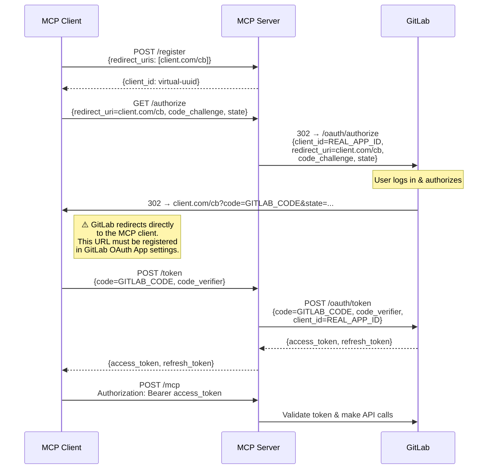
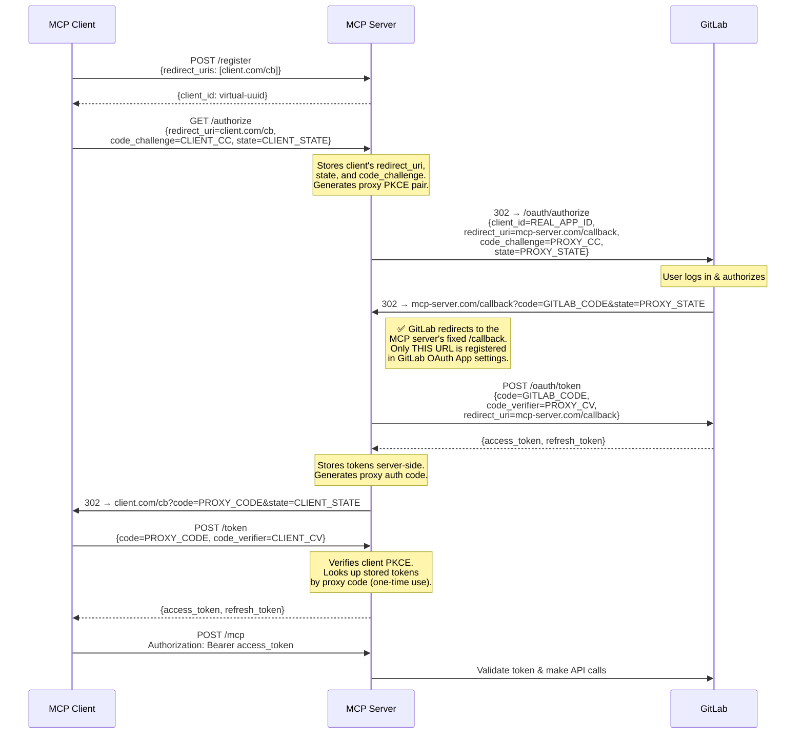

# GitLab MCP OAuth Callback Proxy

## Problem

The current OAuth flow requires each MCP client's callback URL to be pre-registered in the GitLab OAuth Application settings. This means GitLab admin involvement for every new client deployment.

## Passthrough Mode (Default — GITLAB_OAUTH_CALLBACK_PROXY=false)

GitLab redirects **directly back to the MCP client**. The MCP server only proxies the client_id and token exchange — it never receives the callback.



**Problem**: Every MCP client needs its callback URL registered in GitLab Admin → Applications. New client = new URL = GitLab admin involvement.

## Callback Proxy Mode (GITLAB_OAUTH_CALLBACK_PROXY=true)

The MCP server **intercepts the callback itself**, exchanges the code with GitLab, stores the tokens server-side, and redirects to the client with a proxy code. Only ONE fixed URL needs to be registered with GitLab.



**Result**: Only `https://mcp-server.example.com/callback` needs to be registered in GitLab. Works with any number of MCP clients without GitLab admin changes.

## Security

| Property | How It's Enforced |
|----------|------------------|
| Dual PKCE | Separate pairs for client↔server and server↔GitLab legs |
| Proxy codes are one-time use | Deleted from store after first `/token` exchange |
| Proxy codes expire | 10-minute TTL, checked before returning tokens |
| Client PKCE is verified | `code_verifier` is mandatory when `code_challenge` was stored |
| State is not replayable | Deleted from pending store after `/callback` consumes it |
| Error responses are sanitized | Generic messages to clients, details in server logs only |
| Bounded memory | In-memory LRU cache, max 1000 entries |

## Configuration

```bash
# Enable callback proxy mode
GITLAB_MCP_OAUTH=true
GITLAB_OAUTH_CALLBACK_PROXY=true
MCP_SERVER_URL=https://mcp-server.example.com
GITLAB_OAUTH_APP_ID=<app-id>
```

In GitLab Admin → Applications:
- Set the redirect URI to `https://mcp-server.example.com/callback`
- Ensure Confidential is **unchecked** (public client, PKCE replaces client_secret)
- Enable the required scopes (e.g. `api`, `read_api`, `read_user`)
